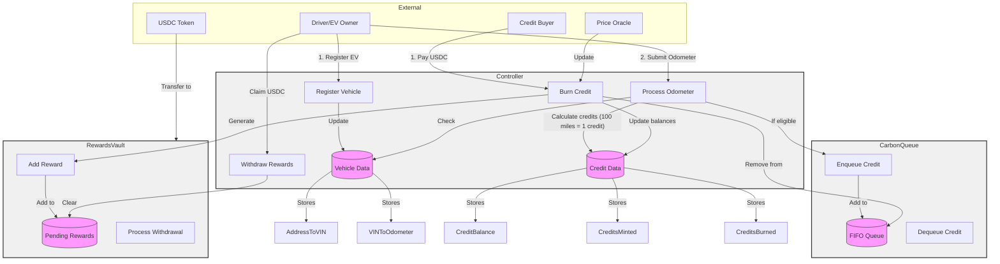

# EV Carbon Credits 

Drive to Earn protocol for EV owners.

## System Overview - What is it?

The EV Carbon Credits Protocol is a decentralized system that enables electric vehicle owners to earn carbon credits based on how much they drive, For every 100 miles driven, 1 carbon credit is awarded to the EV owner.

The system uses a FIFO (First In, First Out) queue mechanism for credit allocation, ensuring fair distribution of rewards. When a buyer buys (burns) carbon credit, based on the FIFO queue - the credit owner is rewarded.

The Smart Contracts for this system are deoployed on Hedera, and we also use HCS topics for decentralized record keeping of cars getting registered with VIN. 

## System Architecture - How it all Works?

Three parts makes up our decentralized system:

1. Car Registration using HCS 
2. Odometer Syncing (Oracles and TEEs)
3. Hedera Smart Contracts 

The diagram below shows our entire system architecture showing all three parts of the system.


We will go over each of these parts in details for a better understanding.


## 1. Car Registration using HCS


For a user to register his/her car to our system, it should already be registered with [SmartCar](https://smartcar.com/). Once it is registered there, user is eady to register it with our system.

User registers with VIN, and his Hedera Address (account whwre he has private key access to). We decode the VIN, and pass it via VIN verifier script that makes sure that the car in question is indeed an EV car. 

> Note: for now we are only allowing Tesla Users to register, but later, we will allow all EV cars to register

A vehicle identification number (VIN) is a unique 17-character code that identifies a specific vehicle. The VIN digits 1-3 is World Manufacturing Identifier, and we check for the following Tesla WMI identifiers: 

* 5YJ = Fremont, California (now designated for Model S & Model 3 from 2022+)
* 7SA = Fremont, California (now designated for Model X & Model Y from 2022+)
* LRW = China
* XP7 = Germany
* SFZ = UK (Roadster 1)

We will be adding other manufacturers in the future, we only support Tesla in our Proof of Concept.

The VIN verification results are recorded as auditable logs of immutable and timestamped events using the Hedera Consensus Service (HCS). 

We create a HCS topic and publish the verification data, which is then consumed by a bot using mirror node API and fed into smart contract. 

We will also store this in a DB for our webapp, however we have implemented that yet. 

## 2. Odometer Syncing (Oracles and TEEs)


## 3. Hedera Smart Contracts


### Controller Contract
The Controller serves as the central hub and only entry point for all system interactions. It coordinates between the queue and rewards mechanisms while managing vehicle registration and mileage tracking. The Controller is owned by an admin account and interfaces with a designated price oracle account for setting credit prices.

Key responsibilities:
- Vehicle registration and odometer reading processing
- Credit price management through the price oracle
- Coordination of credit minting and burning operations
- Management of all external interactions with users

### CarbonQueue Contract 
The CarbonQueue implements the FIFO mechanism for credit management using internal functions that only the Controller can access. It maintains an ordered list of credit holders, ensuring the first credits minted are the first ones available for purchase.

Key features:
- Internal enqueue function for adding new credits when miles are driven
- Internal dequeue function for removing credits when purchased
- Tracking of credit validity and ownership

### RewardsVault Contract
The RewardsVault manages the USDC holdings and reward distribution system through internal functions accessible only to the Controller. It securely holds USDC from credit purchases until credit generators withdraw their rewards.

Key features:
- Safe USDC storage from credit purchases
- Internal reward allocation tracking
- Secure withdrawal mechanism for credit generators

## Key Workflows

### Credit Generation
1. Admin registers an EV owner's vehicle with their VIN
2. Admin submits odometer readings
3. System calculates miles driven and mints credits (1 credit per 100 miles)
4. New credits are added to the FIFO queue

### Credit Purchase
1. Buyer sends USDC to purchase credits
2. System dequeues oldest credits from the queue
3. Original credit generators receive USDC rewards in their pending balance
4. Credit balances update for all parties

### Reward Withdrawal
1. Credit generators can withdraw their accumulated USDC rewards at any time
2. Withdrawal triggers a direct USDC transfer from the vault

## Access Control
- Only the admin can register vehicles and process odometer readings
- Only the price oracle can update credit prices
- Public functions are exclusively available through the Controller
- Queue and Vault functions are internal and only callable by the Controller

This architecture ensures secure, efficient, and fair operation of the carbon credits system while maintaining clear separation of concerns between components.

## System Architecture




## Usage

### Build

```shell
$ forge build
```

### Test

```shell
$ forge test
```

### Format

```shell
$ forge fmt
```

### Gas Snapshots

```shell
$ forge snapshot
```

### Anvil

```shell
$ anvil
```

### Deploy

```shell
$ forge script script/Counter.s.sol:CounterScript --rpc-url <your_rpc_url> --private-key <your_private_key>
```

### Cast

```shell
$ cast <subcommand>
```

### Help

```shell
$ forge --help
$ anvil --help
$ cast --help
```
