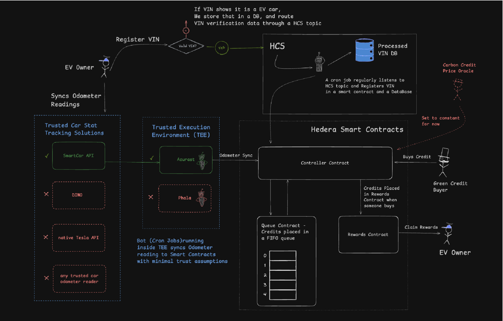
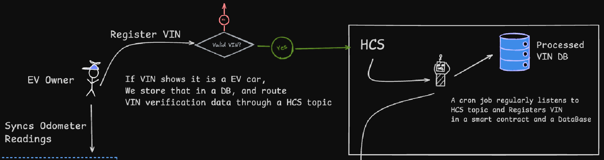
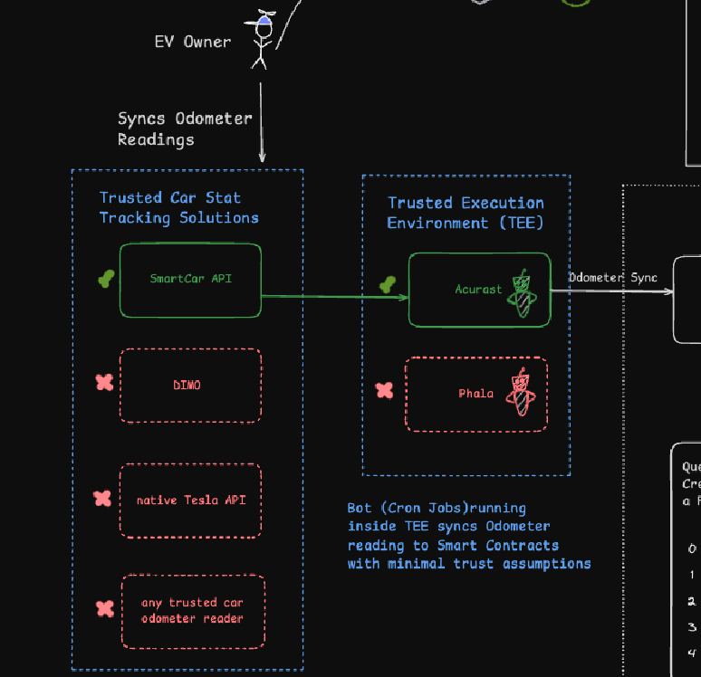
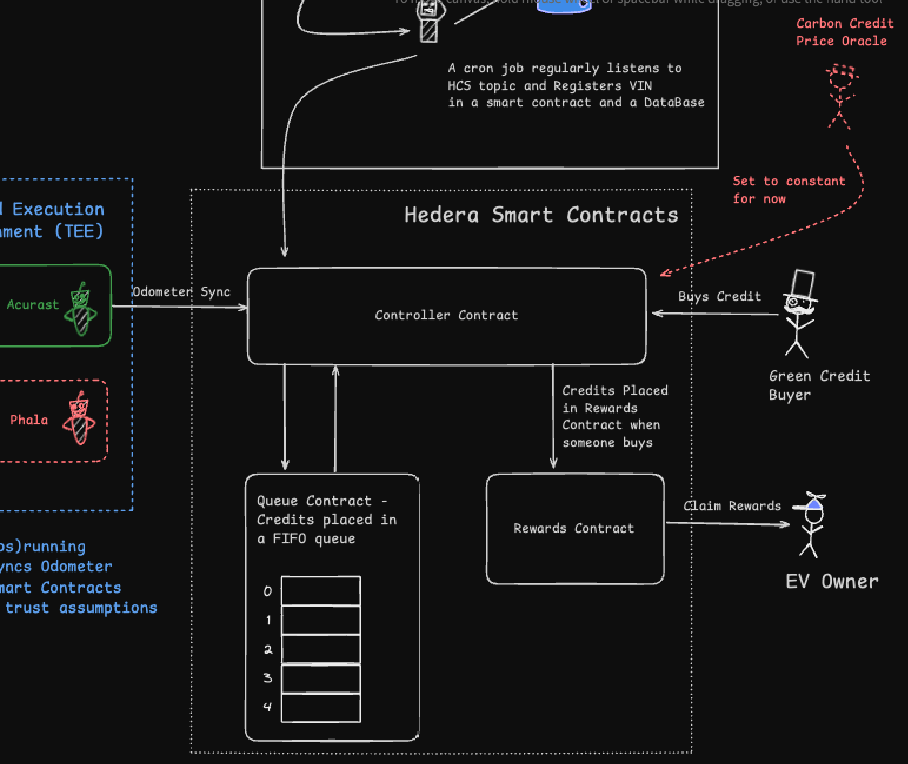
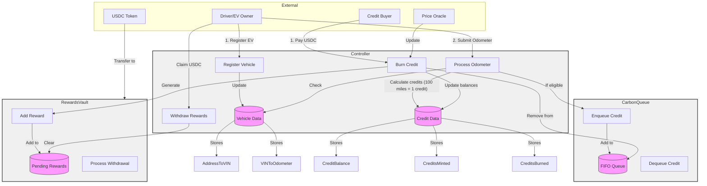

# EV Carbon Credits 

Drive to Earn protocol for EV owners.

## Github Links
* Contracts: https://github.com/enderNakamoto/green_credits
* UI : https://github.com/jsmaxi/green_credits_ui

## System Overview - What is it?

The EV Carbon Credits Protocol is a decentralized system designed to reward electric vehicle (EV) owners for their positive environmental impact. Owners earn 1 carbon credit for every 100 miles driven, making it easy to incentivize and track sustainable behavior.

Modern EVs naturally record mileage data, and we use this information to quantify the environmental benefits. On average, a gasoline car emits 400 grams of carbon dioxide per mile. By driving an EV, users avoid these emissions, contributing to a reduction of approximately 0.4 metric tons of carbon for every 1,000 miles traveled. This highlights the tangible role EV drivers play in reducing greenhouse gases and protecting the environment.

The protocol uses a FIFO (First In, First Out) queue to distribute rewards fairly. When a carbon credit is purchased (or burned), the reward is allocated to the appropriate credit holder based on their position in the queue.

This system is powered by smart contracts deployed on the Hedera network. To ensure secure and decentralized record-keeping, Hedera Consensus Service (HCS) topics are used to log vehicle registrations, identified by their VIN (Vehicle Identification Number).

## System Architecture - How it all Works?

Three parts makes up our decentralized protocol:

1. Car Registration using HCS 
2. Odometer Syncing (Oracles and TEEs)
3. Hedera Smart Contracts 

The diagram below shows our entire system architecture showing all three parts of the system.

We will go over each of these parts in details for a better understanding.

## 1. Car Registration using HCS

To register a vehicle in our system, it must first be registered with SmartCar. Once registered there, the user can proceed to register the vehicle with us.

The registration process involves submitting the Vehicle Identification Number (VIN) and the user's Hedera account address (to which they have private key access). We decode the VIN and validate it using a VIN verification script to confirm that the vehicle is indeed an electric vehicle (EV).

Note: Currently, we are only allowing Tesla vehicles to register in our system, but we plan to expand support to all EVs in the future.

A VIN is a unique 17-character code that identifies a specific vehicle. For Tesla vehicles, we check the World Manufacturer Identifier (WMI), which corresponds to the first three digits of the VIN. Supported Tesla WMI codes include:

5YJ: Fremont, California (Model S & Model 3 from 2022 onward)
7SA: Fremont, California (Model X & Model Y from 2022 onward)
LRW: China
XP7: Germany
SFZ: United Kingdom (Roadster 1)
We record the VIN verification results using the Hedera Consensus Service (HCS), which provides auditable logs of immutable and timestamped events.

For each verification, we create an HCS topic and publish the verification data. This data is then processed by a bot using the Hedera mirror node API and passed to the associated smart contract.

To support our web application, we also plan to store this information in a database. However, this feature is not yet implemented in the current Proof of Concept.

## 2. Odometer Syncing (Oracles and TEEs)

## 3. Hedera Smart Contracts

### Controller Contract
The Controller serves as the central hub and only entry point for all system interactions. It coordinates between the queue and rewards mechanisms while managing vehicle registration and mileage tracking. The Controller is owned by an admin account and interfaces with a designated price oracle account for setting credit prices.

Key responsibilities:
- Vehicle registration and odometer reading processing
- Credit price management through the price oracle
- Coordination of credit minting and burning operations
- Management of all external interactions with users

### CarbonQueue Contract 
The CarbonQueue implements the FIFO mechanism for credit management using internal functions that only the Controller can access. It maintains an ordered list of credit holders, ensuring the first credits minted are the first ones available for purchase.

Key features:
- Internal enqueue function for adding new credits when miles are driven
- Internal dequeue function for removing credits when purchased
- Tracking of credit validity and ownership

### RewardsVault Contract
The RewardsVault manages the USDC holdings and reward distribution system through internal functions accessible only to the Controller. It securely holds USDC from credit purchases until credit generators withdraw their rewards.

Key features:
- Safe USDC storage from credit purchases
- Internal reward allocation tracking
- Secure withdrawal mechanism for credit generators

## System Architecture

