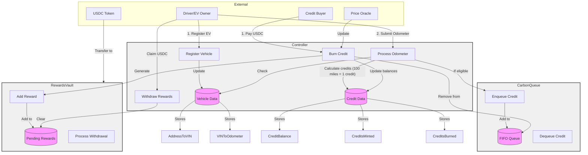

# EV Carbon Credits System Architecture

## System Overview
The EV Carbon Credits system enables electric vehicle owners to earn carbon credits based on their mileage driven, which can then be purchased by buyers using USDC. The system uses a FIFO (First In, First Out) queue mechanism for credit allocation, ensuring fair distribution of rewards.

## Core Contracts

### Controller Contract
The Controller serves as the central hub and only entry point for all system interactions. It coordinates between the queue and rewards mechanisms while managing vehicle registration and mileage tracking. The Controller is owned by an admin account and interfaces with a designated price oracle account for setting credit prices.

Key responsibilities:
- Vehicle registration and odometer reading processing
- Credit price management through the price oracle
- Coordination of credit minting and burning operations
- Management of all external interactions with users

### CarbonQueue Contract 
The CarbonQueue implements the FIFO mechanism for credit management using internal functions that only the Controller can access. It maintains an ordered list of credit holders, ensuring the first credits minted are the first ones available for purchase.

Key features:
- Internal enqueue function for adding new credits when miles are driven
- Internal dequeue function for removing credits when purchased
- Tracking of credit validity and ownership

### RewardsVault Contract
The RewardsVault manages the USDC holdings and reward distribution system through internal functions accessible only to the Controller. It securely holds USDC from credit purchases until credit generators withdraw their rewards.

Key features:
- Safe USDC storage from credit purchases
- Internal reward allocation tracking
- Secure withdrawal mechanism for credit generators

## Key Workflows

### Credit Generation
1. Admin registers an EV owner's vehicle with their VIN
2. Admin submits odometer readings
3. System calculates miles driven and mints credits (1 credit per 100 miles)
4. New credits are added to the FIFO queue

### Credit Purchase
1. Buyer sends USDC to purchase credits
2. System dequeues oldest credits from the queue
3. Original credit generators receive USDC rewards in their pending balance
4. Credit balances update for all parties

### Reward Withdrawal
1. Credit generators can withdraw their accumulated USDC rewards at any time
2. Withdrawal triggers a direct USDC transfer from the vault

## Access Control
- Only the admin can register vehicles and process odometer readings
- Only the price oracle can update credit prices
- Public functions are exclusively available through the Controller
- Queue and Vault functions are internal and only callable by the Controller

This architecture ensures secure, efficient, and fair operation of the carbon credits system while maintaining clear separation of concerns between components.

## System Architecture




## Usage

### Build

```shell
$ forge build
```

### Test

```shell
$ forge test
```

### Format

```shell
$ forge fmt
```

### Gas Snapshots

```shell
$ forge snapshot
```

### Anvil

```shell
$ anvil
```

### Deploy

```shell
$ forge script script/Counter.s.sol:CounterScript --rpc-url <your_rpc_url> --private-key <your_private_key>
```

### Cast

```shell
$ cast <subcommand>
```

### Help

```shell
$ forge --help
$ anvil --help
$ cast --help
```
